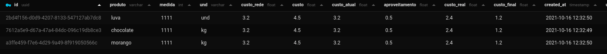
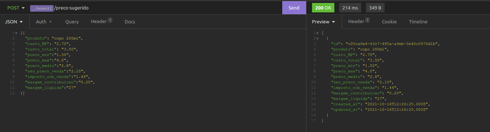

<h1 align="center">Fabrica de Chocolate Backend</h1>

  <a href="#-tecnologias">Tecnologias</a>&nbsp;&nbsp;&nbsp;|&nbsp;&nbsp;&nbsp;
  <a href="#-projeto">Projeto</a>&nbsp;&nbsp;&nbsp;|&nbsp;&nbsp;&nbsp;
  <a href="#-como-executar">Como executar</a>&nbsp;&nbsp;&nbsp;|&nbsp;&nbsp;&nbsp;

 

## ✨ Tecnologias

Esse projeto foi desenvolvido com as seguintes tecnologias:

- [TypeScript](https://www.typescriptlang.org/)
- [TypeORM](https://typeorm.io/#/)
- [Express](https://expressjs.com/pt-br/)
- [SQL Editor Beekeeper Studio](https://www.beekeeperstudio.io/)

## 🍫 projeto

Este projeto esta sendo desenvolvido por apenas uma pessoa, com fim de aprimorar o conhecimento em backend.

- Versão (1.0.0)

  Foi adicionado e configurado os primeiros arquivos, foi criado tambem a primeira rota para adicionar e popular a tabela de insumos, 
  segue a primeira imagem de como esta, onde o lado esquerdo é oque foi enviado para o servidor e o lado direito o retorno de criação.
  
  
  
  
  adicionado recentemente agora a criação da tabela de preços sugeridos com as configurações para popular a tabela.
  
  

## 🚀 Como executar

- Clone o repositório
- Instale as dependências com `yarn`
- Inicie o servidor com `yarn dev`

A aplicação pode ser acessada em [`localhost:3000`](http://localhost:3000).
